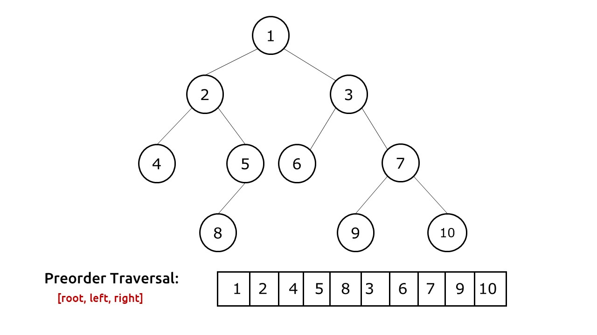
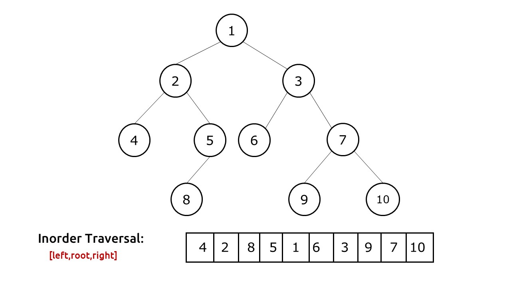
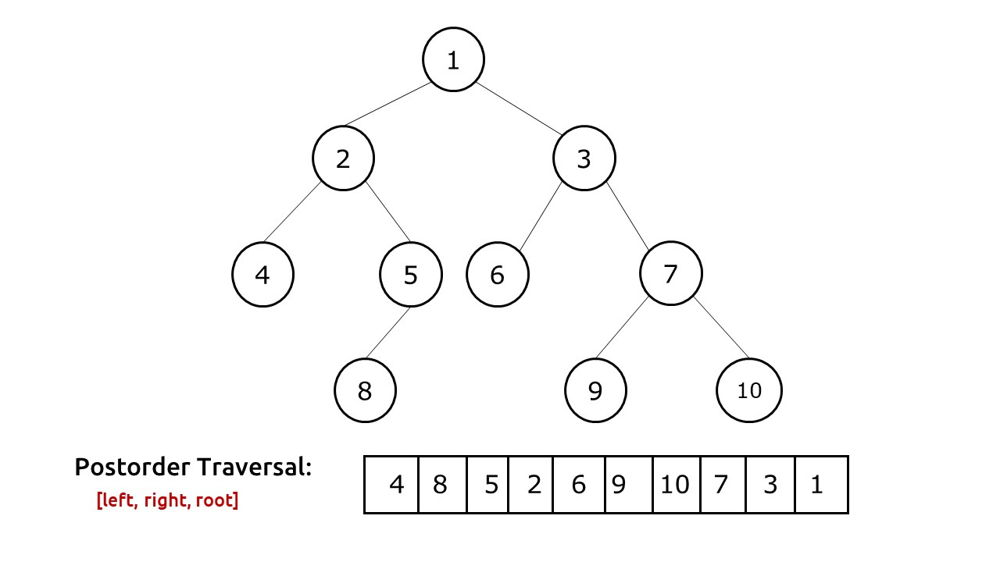
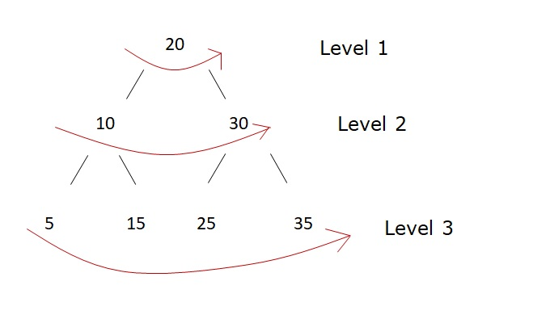
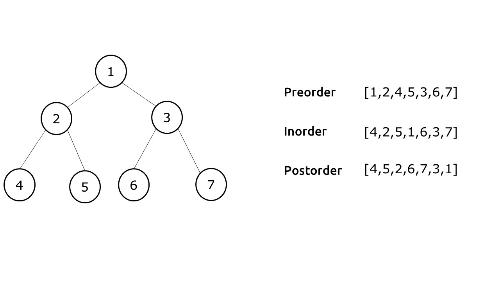
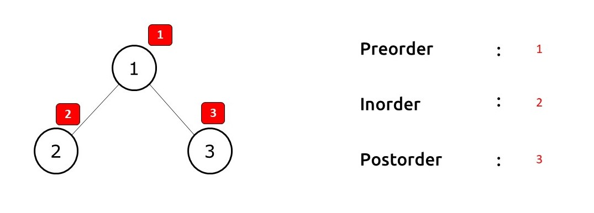
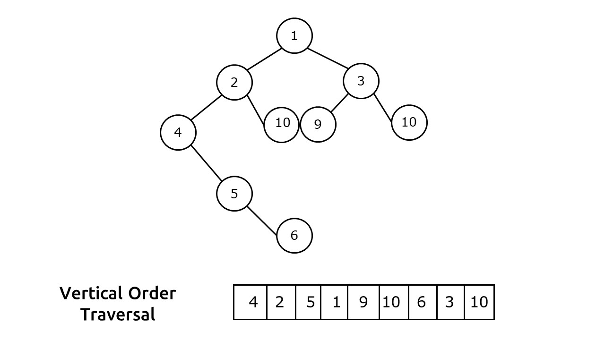
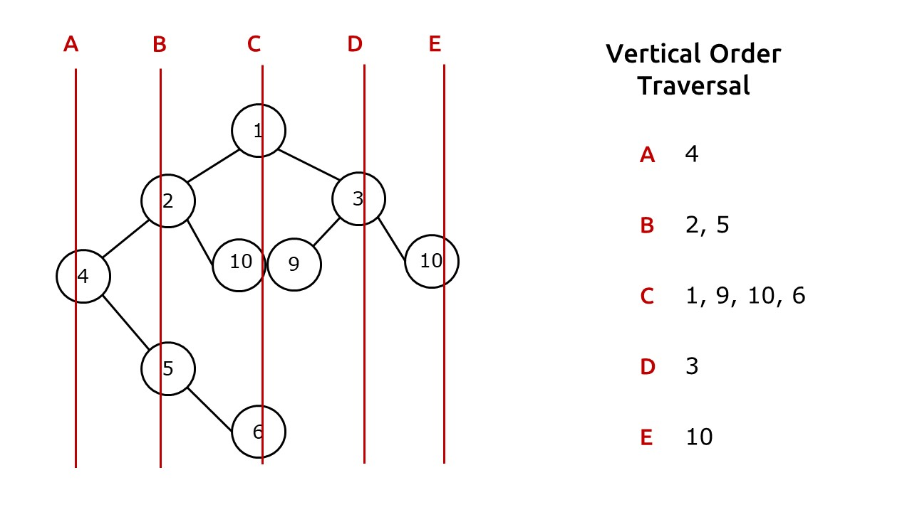
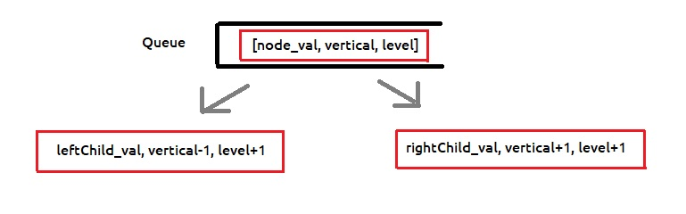
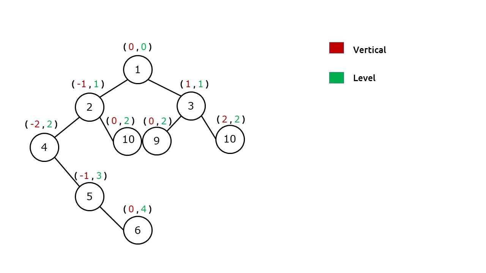

# BinaryTree Traversal
### Depth First Search
* Preorder Traversal
* Inorder Traversal
* Postorder Traversal
---
### Breath First Search
* Level Order Traversal
---
### Vertical Order Traversal

---
## [Preorder Traversal]() 
[ *Root Left Right* ]


***Iterative Approach***
* Take Stack Data Structure.
* If root is not null push it into the stack.
* Iterate the stack till it becomes empty.
* Add the root in List and pop it from stack.

***Now we first push right Node of tree into stack rather than left. We do so because stack is a last-in-first-out(LIFO) data structure. We need to access the left child first, so we need to push it at the last.***

* Keep Iterating till the stack becomes empty.

### ***Time Complexity: O(N)***
### ***Space Complexity: O(N)***

---
## [Inorder Traversal]()
[ *Left Root Right* ]


***Iterative Approach***
* Take Stack Data Structure and set a infinite loop.
* Check only for two things if root is null or not null and iterate accordingly.
* If root is not null means we can go to left of tree thus push current element in stack and keep moving left.
* If the root is null.
*  1. And Stack is also empty break out of loop because we have iterated the complete tree.
*  2. Else pop the element from stack and add it into list and then move to the right child.

***Stack is a Last-In-First-Out (LIFO) data structure, therefore when we encounter a node, we simply push it to the stack and try to find nodes on its left. When the current node points to NULL, it means that there is nothing left to traverse and we should move to the parent. This parent is always placed at the top of the stack. If the stack is empty, then we had already traversed the whole tree and should stop the execution.***

### ***Time Complexity: O(N)***
### ***Space Complexity: O(N)***

---

## [Postorder Traversal]()
[ *Left Right Root* ]


***Iterative Approach***
* Take a Stack Data Structure and a current point.
* Make current pointer point towards root.
* Iterate in Stack till current becomes null or stack becomes empty.
* If current is not null put current node in stack and move towards left.
* If current becomes null take a temp variable and set it to current's parent right child.

*parent node is present at peek of stack.*
* If temp is not pointing to null initialise current as temp, hence again start moving left.
* But if temp also becomes null that means we have covered both right and left child of temp, Thus set temp as stack's peek and start adding elements to list. Also this new temp can be the right child of node present at the top. Therefore run a additional while loop to check for this case.
```
  while(!st.empty() && temp == st.peek().right){
                        temp = st.peek();
                        list.add(temp.data);
                        st.pop();
                    }
```

### ***Time Complexity: O(2N)***
### ***Space Complexity: O(N)***

---
## [Level Order Traversal]()


* Take a Queue Data Structure.
* Add root into queue and iterate till queue becomes empty.
* Run a for loop till the current size of queue.
* In every iteration, pop out from the front of the queue and assign it to a variable say temp add temp into list.
* If temp has a left child add it into queue same for right child as well.

### ***Time Complexity: O(N)***
### ***Space Complexity: O(N)***

---
## [Preorder, Inorder and Postorder Traversal]()



* Take a Stack Data Structure and push <root,1> into stack.
* Iterate till the stack becomes empty.
* In every iteration, we pop the top of the stack say, T. Then we check the second value num of T.

***T is contains Pair class***
```
Pair(Node node, int num){
            this.node = node;
            this.num = num;
        }
 
```
* Three cases can arise:
* 1. if ***num == 1*** add node in Preorder list and increment value of num and push T in stack, Also after this we wish to visit the left child, hence if left child != null push new Pair(T.node.left,1).
* 2. if ***num == 2*** add node in Inorder list and increment value of num and push T in stack, Also after this we wish to visit the right child, hence if right child != null push new Pair(T.node.right,1).
* 3. if ***num == 3*** add node in Postorder List.

### ***Time Complexity: O(N)***
### ***Space Complexity: O(N)***

---
## [Vertical Order Traversal]()



***Using level order traversal***

Step-1: ***Assigning vertical and level to every node***
>Take a Queue Data Structure push root in it with two more variable vertical and level both initialized as zero. Now whenever we move toward left [Vertical - 1, Level + 1] and whenever we move toward right [Vertical + 1, Level + 1]



Step-2: ***Storing Verticals and levels to our data structure***


Step 3: ***Printing vertical order traversal from our data structure***
```
 List < List < Integer >> list = new ArrayList < > ();
        for (TreeMap < Integer, PriorityQueue < Integer >> ys: map.values()) {
            list.add(new ArrayList < > ());
            for (PriorityQueue < Integer > nodes: ys.values()) {
                while (!nodes.isEmpty()) {
                    list.get(list.size() - 1).add(nodes.poll());
                }
            }
        }
```

### ***Time Complexity: O(N * logN * logN * logN)***
### ***Space Complexity: O(N)***

---